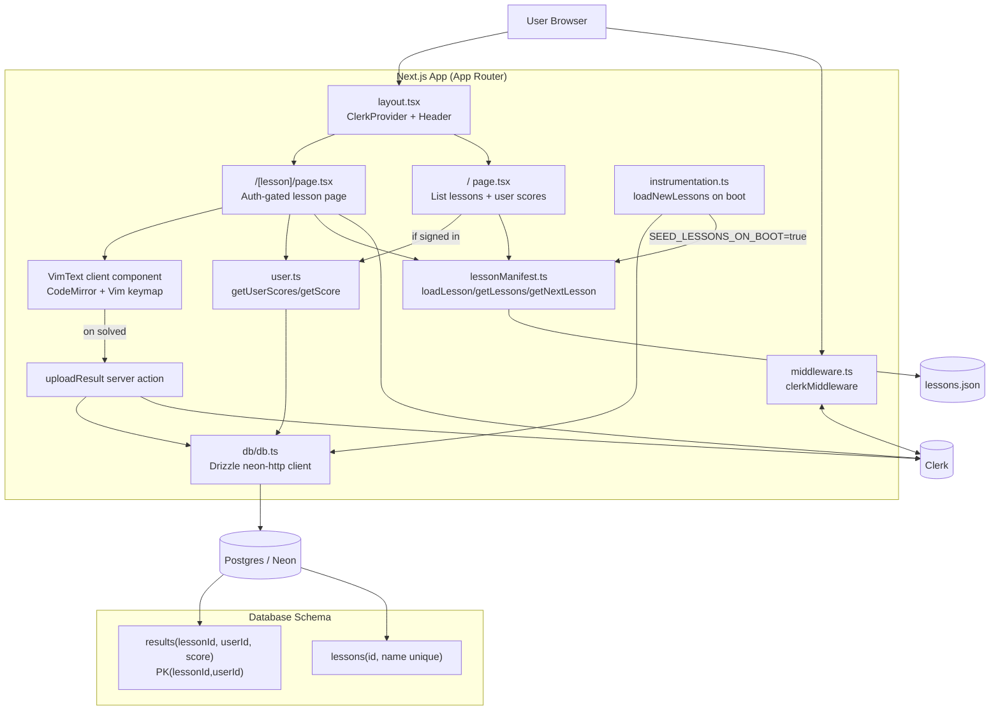

# Architecture

```mermaid
flowchart TD
    U[User Browser]
    Clerk[(Clerk)]
    JSON[(lessons.json)]
    PG[(Postgres / Neon)]

    subgraph Next["Next.js App (App Router)"]
        MW["middleware.ts\nclerkMiddleware"]
        Layout["layout.tsx\nClerkProvider + Header"]
        Home["/ page.tsx\nList lessons + user scores"]
        Lesson["/[lesson]/page.tsx\nAuth-gated lesson page"]
        VimText["VimText client component\nCodeMirror + Vim keymap"]
        Action["uploadResult server action"]
        Manifest["lessonManifest.ts\nloadLesson/getLessons/getNextLesson"]
        UserQueries["user.ts\ngetUserScores/getScore"]
        DB["db/db.ts\nDrizzle neon-http client"]
        Seed["instrumentation.ts\nloadNewLessons on boot"]
    end

    subgraph DBSchema["Database Schema"]
        LessonsTbl["lessons(id, name unique)"]
        ResultsTbl["results(lessonId, userId, score)\nPK(lessonId,userId)"]
    end

    U --> MW
    MW <--> Clerk
    U --> Layout
    Layout --> Home
    Layout --> Lesson

    Home --> Manifest
    Home -->|if signed in| UserQueries
    Lesson --> Clerk
    Lesson --> Manifest
    Lesson --> UserQueries
    Lesson --> VimText
    VimText -->|on solved| Action
    Action --> Clerk

    Manifest --> JSON
    UserQueries --> DB
    Action --> DB
    Seed -->|SEED_LESSONS_ON_BOOT=true| Manifest
    Seed --> DB

    DB --> PG
    PG --> LessonsTbl
    PG --> ResultsTbl
```
